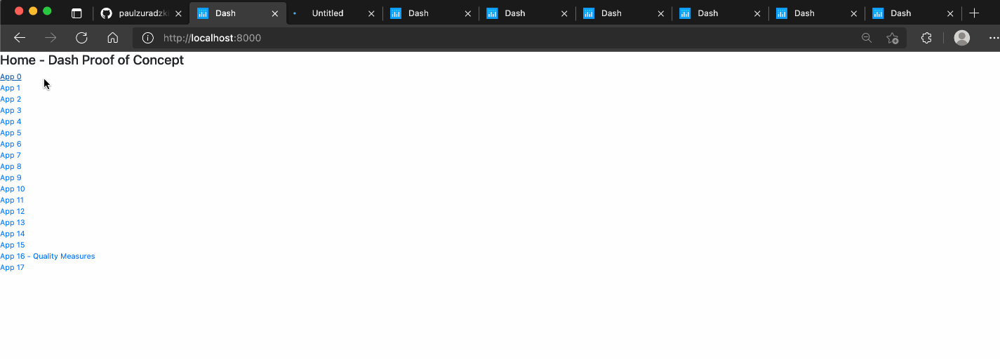

# Dash Multi-App Demo

This application demonstrates the capabilities of Dash, a Python library for making analytic web apps.
* This is a multi-page application with URL routing ([docs](https://dash.plotly.com/urls)).
* Written on top of Plotly.js and React.js, Dash is a Python library for building data apps with customized user interfaces in pure Python, R, or Julia. It's particularly suited for anyone who works with data. Dash apps are rendered in the web browser. You can read more about Dash from its publisher, Plotly, [here](https://dash.plotly.com/).

## Demo


## Instructons (Development)
These are instructions for dev purposes. For a production environment, see the detailed guide below.
```bash
$ git clone git@github.com:paulzuradzki/dash-multiapp-demo.git
$ cd dash-multiapp-demo
$ python -m venv venv

# Mac/Linux
$ source venv/bin/activate

# for Windows
$ venv\Scripts\activate.bat

$ pip install -r requirements.txt

# run application
$ python index.py

# type localhost:8000 into your browser
```

<!-- TODO: add instructions for alternative to `pip install` from the web (install from wheels/zip file instead) -->

# Python Web Application Server Setup for Production

## Contents
* [Terms](#terms)
* [References](#references)
* [Assumptions](#assumptions)
* [Steps](#steps)
    * [Initial user setup for server](#initial-user-setup-for-server)
    * [Secure the server](#secure-the-server)
    * [Install server dependencies](#install-server-dependencies)
    * [Install your web application and Python dependencies](#install-your-web-application-and-python-dependencies)
    * [`gunicorn` - set up the Python WSGI (Web Service Gateway Interface) server](#gunicorn-\--set-up-the-python-wsgi-web-service-gateway-interface-server)
    * [`supervisor` - set up process control](#supervisor-\--set-up-process-control)
    * [`nginx` - set up the web server](#nginx-\--set-up-the-web-server)
    * [HTTPS and SSL Cert Setup](#https-and-ssl-cert-setup)
    * [Offline Deployment Resources](#offline-deployment-resources)

## Terms
* `supervisor` enables processes to run as background services and restart when the server reboots
* `gunicorn` is a Python WSGI (web server gateway interface) server which interfaces between our web app and the web server
    * a WSGI container is a separate running process that runs on a different port than your web server 
    * your web server is configured to pass requests to the WSGI container which runs your web application, then it passes the response (in the form of HTML) back to the requester
* `nginx` (alternative to Apache HTTP server) is a web server that responds directly to client requests

## References
* https://www.digitalocean.com/community/tutorials/initial-server-setup-with-ubuntu-20-04
* https://blog.miguelgrinberg.com/post/the-flask-mega-tutorial-part-xvii-deployment-on-linux
* https://www.digitalocean.com/community/tutorials/how-to-set-up-ssh-keys-on-ubuntu-20-04
* https://www.digitalocean.com/community/tutorials/how-to-secure-nginx-with-let-s-encrypt-on-ubuntu-20-04
* https://www.freecodecamp.org/news/the-nginx-handbook

## Assumptions
* You have access to a server
    * You have a server (Ubuntu 20.04) to which you can SSH into
        * Your security settings likely need to be modified to permit your IP address for SSH access
    * You have access to a root/superuser private key or password on the server
        * e.g., for AWS EC2, you should have a private key file
    * Set up to use Amazon EC2 - https://docs.aws.amazon.com/AWSEC2/latest/UserGuide/get-set-up-for-amazon-ec2.html
* Beginner familiarity with git and Linux commands. Below are resources.
    * Linux Journey - https://linuxjourney.com/
    * Git and GitHub for Python Developers - https://realpython.com/python-git-github-intro/

___
# Steps

## Initial user setup for server
* Create a user and grant admin rights
* Setup SSH for super user
* I use the username `pz-dev` throughout the ReadMe demo. Modify the name to your own choosing.
    * Note: if you use a different username, make sure that you are using the correct username in config files and terminal commands throughout

Create a user and grant admin rights
```bash
$ ssh root@your_server_ip       # connect to host; you may need to replace "root" with "ubuntu"
$ adduser pz-dev                # add user
$ usermod -aG sudo pz-dev       # grant admin rights
$ su pz-dev                     # switch to new user
$ mkdir ~/.ssh                  # make this directory in USER home (not root) if it does not exists
$ touch ~/.ssh/authorized_keys                                  # make this file
$ echo {YOUR CLIENT HOST PUBLIC KEY} >> ~/.ssh/authorized_keys  # append public key info to file 
$ chmod 600 ~/.ssh/authorized_keys                              # restrict permissions to file
```

## Secure the server
* Disable root login
* Disable password authentication
* Set up firewall and rules

Modify the sshd_config file (e.g., using vim)
```bash
# /etc/ssh/sshd_config
PermitRootLogin no              # Disable root logins
PasswordAuthentication no       # Disable password logins
```

For the firewall, enable SSH, HTTPS, and HTTP
```bash
$ sudo apt-get install -y ufw
$ sudo ufw allow ssh
$ sudo ufw allow http
$ sudo ufw allow 443/tcp
$ sudo ufw --force enable
$ sudo ufw status
```

## Install server dependencies
```bash
$ sudo apt-get -y update
$ sudo apt-get -y install python3 python3-venv python3-dev
$ sudo apt-get -y install supervisor nginx git
```

## Install your web application and Python dependencies
```bash
$ cd ~
$ mkdir repos
$ cd repos
# get application from GitHub
$ git clone https://github.com/paulzuradzki/dash-multiapp-demo.git

# create a virtual environment and install Python dependencies specified in requirements.txt
$ cd dash-multiapp-demo
$ python3 -m venv venv
$ source venv/bin/activate
(venv) $ pip install --upgrade pip
(venv) $ pip install -r requirements.txt

# also install gunicorn (WSGI server)
$ pip install gunicorn
```


## `gunicorn` - set up the Python WSGI (Web Service Gateway Interface) server
* This command manually runs the app from the gunicorn WSGI server
* The FLASK_APP environment variable is for using `flask run` commands; however, the Flask built-in server is not meant for production
* gunicorn WSGI server is one step closer to production. WSGI server is an interface between our Python app and the web server that handles requests (nginx or Apache HTTP)
* If the server were to reboot, we don't want to have to do this manually, so we will automate the restart using `supervisor` in a later step
* `-b localhost:8000` tells WSGI on what port we will run the app
* The app will run on 8000. A web server (nginx) will directly receive HTTPS/HTTP requests on 443/80 and forward them to gunicorn WSGI server and the Python application  
* for `index:server`, `index` is the name of the Python module file containing the `server` variable. This may differ from app to app depending on how where you've created the server variable. E.g., some tutorials online may show something like `app:app` or `app:app.server`. 
* gunicorn must be called from applicaton project directory; else, provide the full path 

```bash
echo "export FLASK_APP=index.py" >> ~/.profile
(venv) $ gunicorn -b localhost:8000 -w 4 index:server

# or
(venv) /home/pz-dev/repos/dash-multiapp-demo/venv/bin/gunicorn -b localhost:8000 -w 4 index:server
```


## `supervisor` - set up process control
* supervisor makes the app/gunicorn restart in case the server is rebooted; this avoids manual intervention
* note program name (`[program:index]`) if you change the app structure in Flask/Dash
* the command line is what we would 
```bash
# /etc/supervisor/conf.d/dash-app.conf
[program:index]
command=/home/pz-dev/repos/dash-multiapp-demo/venv/bin/gunicorn -b localhost:8000 -w 4 index:server
directory=/home/pz-dev/repos/dash-multiapp-demo
user=pz-dev
autostart=true
autorestart=true
stopasgroup=true
killasgroup=true
```

Reload supervisor after creating supervisor configuration file
```bash
$ sudo supervisorctl reload
```

## `nginx` - set up the web server 
Make self-signed cert for testing
```bash
# run this command from the application directory
# ex: /home/pz-dev/repos/dash-multiapp-demo
openssl req -new -newkey rsa:4096 -days 365 -nodes -x509 \
  -keyout certs/key.pem -out certs/cert.pem
```

Remove default nginx site
```bash
$ sudo rm /etc/nginx/sites-enabled/default
```

Create an nginx web server configuration file for the application
```bash
# /etc/nginx/sites-enabled/dash-app

server {
    # listen on port 80 (http)
    listen 80;
    server_name _;
    location / {
        # redirect any requests to the same URL but on https
        return 301 https://$host$request_uri;
    }
}
server {
    # listen on port 443 (https)
    listen 443 ssl;
    server_name _;

    # location of the self-signed SSL certificate
    ssl_certificate /home/pz-dev/repos/dash-multiapp-demo/certs/cert.pem;
    ssl_certificate_key /home/pz-dev/repos/dash-multiapp-demo/certs/key.pem;

    # write access and error logs to /var/log
    access_log /var/log/dash_app_access.log;
    error_log /var/log/dash_app_error.log;

    location / {
        # forward application requests to the gunicorn server
        proxy_pass http://localhost:8000;
        proxy_redirect off;
        proxy_set_header Host $host;
        proxy_set_header X-Real-IP $remote_addr;
        proxy_set_header X-Forwarded-For $proxy_add_x_forwarded_for;
    }

    location /static {
        # handle static files directly, without forwarding to the application
        alias /home/pz-dev/repos/dash-multiapp-demo/app/static;
        expires 30d;
    }
}

```

Restart Nginx webserver after creating 
```bash
sudo service nginx reload
```

## HTTPS and SSL Cert Setup
* See instructions via Digital Ocean for how to set up signed SSL certificates using LetsEncrypt
* This enables HTTPS for production deployment
* Without HTTPS, the browser will show a warning and may prevent the user from accessing the site
* For corporate deployments, a networking or system admin may have to provide the certificates
* You will have to modify the nginx configuration above to re-point the `ssl_certificate` and `ssl_certificate_key` file paths
* Link: https://www.digitalocean.com/community/tutorials/how-to-secure-nginx-with-let-s-encrypt-on-ubuntu-20-04

## Offline Deployment Resources
* Sometimes a server may not have access to the public internet for security reasons
* In this event, you will not be able to install Python packages with `pip install` from PyPi.org as you normally would
* Here are resources for offline deployment options that use source distributions - distributable zip files that you can install like `pip install my-package.tar.gz` - and/or Docker containers.
* Links
    * https://dabeaz-course.github.io/practical-python/Notes/09_Packages/03_Distribution.html
    * https://realpython.com/pypi-publish-python-package/#building-your-package
    * https://realpython.com/offline-python-deployments-with-docker/ 


## Deploying Application Updates
After pulling new application code, the server must be stopped and restarted like so. Additional steps may be necessary for updating a more complicated Python app (ex: `$ flask db upgrade` to upgrade a database, `$ flask translate compile` for translations).

```bash
(venv) $ git pull                                       # download the new version
(venv) $ sudo supervisorctl stop dash-multiapp-demo     # stop the current server
(venv) $ sudo supervisorctl start dash-multiapp-demo    # start a new server
```